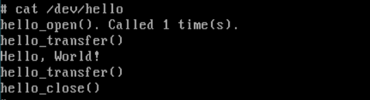

# Part I: Minix Device Drivers

In this part, we will first do a walk through a couple of hello world device drivers, while presenting the code we will explain many of the important concepts that will help you in your tasks.

## 1. What is a device driver?

As mentioned in lectures, a device driver is a program that creates an abstraction layer to facilitate the communication between the drivers and its users such as the operating system and user programs. In minix, device drivers are a user processes, that works in a concurrent manner. Similar to other minix processes drivers minix process communicate via messages. This message are sent using the message data structure available in /include/minix/ipc.h which some aliases defined in /include/minix/com.h. The messages for device drivers are different for character device drivers and block device drivers.

## 1. Hello World Server

The first sample driver is a device driver for nothing, it only starts say hello_world and turns off. To create this driver create a folder named hell_world in /usr/src/drivers. Create the following files:

hello_world.c:

    #include <stdio.h>
    #include <stdlib.h>
    #include <minix/syslib.h>

    int main(int argc, char **argv)
    {
        sef_startup();

        printf("Hello, World!\n");
        return EXIT_SUCCESS;
    }

Makefile:

    # Makefile for the hello_world driver.
    PROG=   hello_world
    SRCS=   hello_world.c
    
    FILES=${PROG}.conf
    FILESNAME=${PROG}
    FILESDIR= /etc/system.conf.d
    
    DPADD+= ${LIBCHARDRIVER} ${LIBSYS}
    LDADD+= -lchardriver -lsys
    
    MAN=
    
    .include <minix.service.mk>

hello_world.conf:

    service hello_world
    {
            system
                    UMAP            # 14
                    IRQCTL          # 19
                    DEVIO           # 21
            ;
            ipc
                    SYSTEM PM RS LOG TTY DS VM VFS
                    pci inet amddev
                    ;
        uid 0;
    };

In order to run the the new driver run

    # make clean
    # make 
    # make install
    # service up /usr/sbin/hello_world

Although you didn't expect this but the server went to an infinite loop. The explanation is simple, since the service shuts down after each time its prints the message, the reincarnation server restarts its and the loop goes on. This is why all long running process such as servers and drivers has a main loop inside us. Lucky for us this most of this can be easily managed using the drivers libraries. 

## 2. A Hello World Server, Again !!!

In this sample, we will show how to make something more interesting, using the drivers libraries. The other demo in we will discuss is a character device driver. The code for this driver already ships with minix in /usr/src/drivers/hello

The folder contains similar files as the previous drivers, Namely:

    Makefile # exactly equal to the make file discussed earlier
    hello.h # contains a simple definition for a hello message string.
    hello.c # the driver code

The hello.c contains many functions and definition, in the following sections we discuss the most import.

### 2.1 Main Function

The main function below is similar to all main function of most drivers, the function is composed of the initialization code and calls the task function with pointers to all the needed functions:

    int main(void)
    {
        /*
        * Perform initialization.
        */
        sef_local_startup();

        /*
        * Run the main loop.
        */
        chardriver_task(&hello_tab, CHARDRIVER_SYNC);
        return OK;
    }

### 2.2 Driver Start up

Remember in tha last section the hello_world driver, the main function called the sef_startup() function defined in /usr/src/lib/libsys/sef.c, this function is used to initialize services and drivers. However, in most cases more initialization code is needed this is where the user defined initialization function sef_local_startup() is need. The function which ultimately calls the sef_startup does driver specific initialization, such as:

1. Call Back function, Note that in this sample all system events are handled using the same function, where different cases are handled inside using a switch case. For more about system event framework visit [link](https://wiki.minix3.org/doku.php?id=developersguide:sef).

1. Register Live Update call back function, this is used to update the driver behavior in run time. 

        static void sef_local_startup()
        {
            /*
            * Register init callbacks. Use the same function for all event types
            */
            sef_setcb_init_fresh(sef_cb_init);
            sef_setcb_init_lu(sef_cb_init);
            sef_setcb_init_restart(sef_cb_init);

            /*
            * Register live update callbacks.
            */
            /* - Agree to update immediately when LU is requested in a valid state. */
            sef_setcb_lu_prepare(sef_cb_lu_prepare_always_ready);
            /* - Support live update starting from any standard state. */
            sef_setcb_lu_state_isvalid(sef_cb_lu_state_isvalid_standard);
            /* - Register a custom routine to save the state. */
            sef_setcb_lu_state_save(sef_cb_lu_state_save);

            /* Let SEF perform startup. */
            sef_startup();
        }

### 2.3. The chardriver_task
The driver task is holder for all the standard functions needs for a driver, these functions includes open, close, etc. These function are defined in order to passed to the chardriver_task() function which contains the infinte loop for the driver to execute.

    /* Entry points to the hello driver. */
    static struct chardriver hello_tab =
    {
        hello_open,
        hello_close,
        nop_ioctl,
        hello_prepare,
        hello_transfer,
        nop_cleanup,
        nop_alarm,
        nop_cancel,
        nop_select,
        NULL
    };

### 2.4. running and testing the server:

    # make clean
    # make 
    # make install
    # service up /usr/sbin/hello -dev /dev/hello

Each time you access the server the using cat the count of the open function increases as follow:

When the driver restarts the defined message should be printed as follows:

A final this to try with the server is to make a live update, the update should include updating the server print string to be goodbye instead of hello world, After you update the code, compile, and install. You can refresh the service again and the following should appear.

## 3. Task

In this task you are expected to implement an in memory device driver that can operate both as a stack and as a queue.

### 3.1. Description
Create a character device driver named **poly_list** that can act both a queue or a stack. The inner implementation of the driver should be able to hold 50 element of an integer type in a fixed size array. The default (on start) behavior of the poly_list should be as a queue. However, only when empty, the user can change the way it operates from queue to stack and back, using the IOCTL operations. The behavior of both the queue or stack should as shown below. Both implementations (stack or queue) should not allow adding items beyond the capacity of the array. The new driver should be mounted on /dev/poly_list with a major/minor numbers 20 and 0 or what ever available on your machine.

### 3.2. Evaluation
In order to demonstrate the correctness please provide a test program that operates the driver as follows:

0. The program will assume the RAM disk driver operates as queue
1. Open the driver
1. Enqueue 5 items to the queue
1. Dequeue the 4 items from the queue
1. Try to convert to stack and (of course as specified earlier it should fail)
1. Dequeue the last item
1. Convert to Stack
1. Push 4 items to the stack
1. Pop the items from the stack
1. Close the driver

Finally details about how to implement Input/Output, IOCTL, and how to write test programs in available in the next section.

## 4. Notes

### 4.1. Other Samples
Although we discussed a method to implement a character device driver, device driver can be done in many methods. However, this is a list of device drivers that follows the same pattern:

1. /drivers/log
2. /drivers/random
3. hello with read/write [github](https://github.com/nathanph/minix-driver). 
4. magic8 driver available on [github](https://github.com/nathanph/minix-driver). 

### 4.2. Device Files
Device files are important for device drivers. These files are also identified with major and minor device numbers. Thus its imports to pick a major and minor number for each new device. To found the used device number you can use this script:

    #!/bin/sh

    ls_output=$(ls -l /dev/)

    echo "$ls_output" | grep "," | awk '{print $5}' | tr "," " " | sort -n | uniq

An example should be something as this:

    # mknod /dev/[name] c [major number] [minor number

### 4.3.	Other Resources 

There are lots of online resource for the setup of Minxi3 tools, the following are just good examples.

* https://wiki.minix3.org/doku.php?id=developersguide:overviewofminixdrivers
* https://wiki.minix3.org/doku.php?id=developersguide:driverprogramming
* https://wiki.minix3.org/doku.php?id=developersguide:blockprotocol
* https://shellsharks.com/technology/2019/10/18/minix-character-device-driver.html
