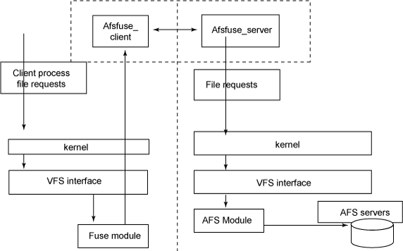
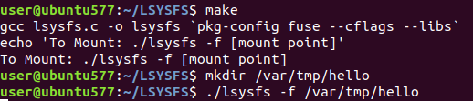
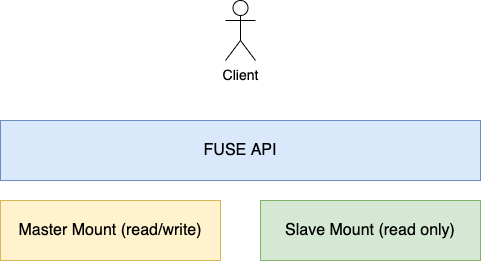

# Part II: FUSE

In this part, we will explain what is FUSE, in this Lab as stated earlier, you are going to use linux (ubuntu 18 LTS) instead of Minix. Just as Minix supports user-space file systems through its micro-kernel architecture, so does FUSE, a cross-platform approach for writing user-space file systems. We will use FUSE in Linux in this lab. In this lab we are going to use libfuse libraries, although its not the only way to develop file system in user space, its one of the most well-documented library and interfaces. The rest of the document will do a quick walk through the preparation martials. The, the description of the lab is given.

## 1. What is FUSE, and Why?

Minix and many micro-kernel operating systems have already separated the file systems from the kernel itself. However, for linux and most operating systems the kernel is still inseparable from the file system. Filesystem in User space or FUSE allows us to create a file system outside from the kernel.

### 1.1. Basics
FUSE is a library that allows you to develop a fully functional file system that can be accessed by non-privileged users. FUSE library, available on [github](https://github.com/libfuse/libfuse), provides a standard method for implementing common and non-common file system functionality. The following figure shows the common architecture of a fuse file system. As shown below FUSE client/server interaction can in the same machine or over multiple machines. 

## 1.2. Why
Linux default file systems are complicated to write as they require a large amount of kernel code, and this can make small modifications a very time consuming task.  FUSE presents an easy API to implement many complicated functionality that is  hard to implement in the kernel, such as encrypted file system, trackable file system, remote file systems, etc.

## 1.3. FUSE Support
FUSE has a large community that has implemented many of functionality needed in both personal and enterprise scenarios.

### 1.3.1. Supported Platform
The Current LibFuse is supported by Linux and MacOS, for example libfuse can installed on ubuntu using

    # sudo apt-get install -y libfuse-dev

However, there is another implementation for windows available in [winfsp](https://github.com/billziss-gh/winfsp). MacFuse is the MacOS version of FUSE.

### 1.3.2 Supported Languages
Fuse is mainly built using c, however its supported by other languages, such as:
1. python
1. go
1. ruby
1. java 
1. ...

## 1.4. FUSE API
In order to define a new file system you first have to implement a set of functions according to the following API.

    struct fuse_operations {
        int (getattr) (const char , struct stat );
        int (readlink) (const char , char , size_t);
        int (getdir) (const char , fuse_dirh_t, fuse_dirfil_t);
        int (mknod) (const char , mode_t, dev_t);
        int (mkdir) (const char , mode_t);
        int (unlink) (const char );
        int (rmdir) (const char );
        int (symlink) (const char , const char );
        int (rename) (const char , const char );
        int (link) (const char , const char );
        int (chmod) (const char , mode_t);
        int (chown) (const char , uid_t, gid_t);
        int (truncate) (const char , off_t);
        int (utime) (const char , struct utimbuf );
        int (open) (const char , struct fuse_file_info );
        int (read) (const char , char , size_t, off_t, struct fuse_file_info );
        int (write) (const char , const char , size_t, off_t,struct fuse_file_info );
        int (statfs) (const char , struct statfs );
        int (flush) (const char , struct fuse_file_info );
        int (release) (const char , struct fuse_file_info );
        int (fsync) (const char , int, struct fuse_file_info );
        int (setxattr) (const char , const char , const char , size_t, int);
        int (getxattr) (const char , const char , char , size_t);
        int (listxattr) (const char , char , size_t);
        int (removexattr) (const char , const char *);
    }; 

These Functions are described as follows:

1. getattr: int (*getattr) (const char *, struct stat *);
This is similar to stat(). The st_dev and st_blksize fields are ignored. The st_ino field is ignored unless the use_ino mount option is given.

1. readlink: int (*readlink) (const char *, char *, size_t);
This reads the target of a symbolic link. The buffer should be filled with a null-terminated string. The buffer size argument includes the space for the terminating null character. If the linkname is too long to fit in the buffer, it should be truncated. The return value should be “0” for success.

1. getdir: int (*getdir) (const char *, fuse_dirh_t, fuse_dirfil_t);
This reads the contents of a directory. This operation is the opendir(), readdir(), …, closedir() sequence in one call. For each directory entry, the filldir() function should be called.

1. mknod: int (*mknod) (const char *, mode_t, dev_t);
This creates a file node. There is no create() operation; mknod() will be called for creation of all non-directory, non-symlink nodes.

1. mkdir: int (*mkdir) (const char *, mode_t);

1. rmdir: int (*rmdir) (const char *);
These create and remove a directory, respectively.

1. unlink: int (*unlink) (const char *);
1. rename: int (*rename) (const char *, const char *);
These remove and rename a file, respectively.

1. symlink: int (*symlink) (const char *, const char *);
This creates a symbolic link.

1. link: int (*link) (const char *, const char *);
This creates a hard link to a file.

1. chmod: int (*chmod) (const char *, mode_t);

1. chown: int (*chown) (const char *, uid_t, gid_t);

1. truncate: int (*truncate) (const char *, off_t);

1. utime: int (*utime) (const char *, struct utimbuf *); 
These change the permission bits, owner and group, size, and access/modification times of a file, respectively.

1. open: int (*open) (const char *, struct fuse_file_info *);
This is the file open operation. No creation or truncation flags (O_CREAT, O_EXCL, O_TRUNC) will be passed to open(). This should check if the operation is permitted for the given flags. Optionally, open() may also return an arbitrary filehandle in the fuse_file_info structure, which will be passed to all file operations.

1. read: int (*read) (const char *, char *, size_t, off_t, struct fuse_file_info *);
This reads data from an open file. read() should return exactly the number of bytes requested, except on EOF or error; otherwise, the rest of the data will be substituted with zeroes. An exception to this is when the direct_io mount option is specified, in which case the return value of the read() system call will reflect the return value of this operation.

1. write: int (*write) (const char *, const char *, size_t, off_t, struct fuse_file_info *);
This writes data to an open file. write() should return exactly the number of bytes requested except on error. An exception to this is when the direct_io mount option is specified (as in the read() operation).

1. statfs: int (*statfs) (const char *, struct statfs *);
This gets filesystem statistics. The f_type and f_fsid fields are ignored.

1. flush: int (*flush) (const char *, struct fuse_file_info *); This represents flush-cached data. It is not equivalent to fsync() — it’s not a request to sync dirty data. flush() is called on each close() of a file descriptor, so if a filesystem wants to return write errors in close() and the file has cached dirty data, this is a good place to write back data and return any errors. Since many applications ignore close() errors, this is not always useful.
Note: The flush() method may be called more than once for each open(). This happens if more than one file descriptor refers to an opened file due to dup(), dup2(), or fork() calls. It is not possible to determine if a flush is final, so each flush should be treated equally. Multiple write-flush sequences are relatively rare, so this shouldn’t be a problem.

1. release: int (*release) (const char *, struct fuse_file_info *);
This releases an open file. release() is called when there are no more references to an open file — all file descriptors are closed and all memory mappings are unmapped. For every open() call, there will be exactly one release() call with the same flags and file descriptor. It is possible to have a file opened more than once, in which case only the last release will count and no more reads/writes will happen on the file. The return value of release is ignored.

1. fsync: int (*fsync) (const char *, int, struct fuse_file_info *);
This synchronizes file contents. If the datasync parameter is non-zero, then only the user data should be flushed, not the meta data.

1. setxattr: int (*setxattr) (const char *, const char *, const char *, size_t, int);

1. getxattr: int (*getxattr) (const char *, const char *, char *, size_t);

1. listxattr: int (*listxattr) (const char *, char *, size_t);

1. removexattr: int (*removexattr) (const char *, const char *); 
These set, get, list, and remove extended attributes, respectively

## 2. Preparation Material
In this lab, you are expected to use the the Ubuntu VM available in [download](https://umass.box.com/shared/static/bwplrdbvsl75mdtv24g8lpnbv2n7dk2i.zip).

### 2.1. Ubuntu VM
The Virtual Machine has the following configuration:

    # username: user
    # password: user

The virtual machine includes essential tools to use fuse; however, you can install any tools that you need, but you must document any additional libraries you have used in your lab documentation. 

### 2.2. Testing Simple FUSE

This section explains how to use FUSE. This sample is adopted from "Writing Less Simple, Yet Stupid Filesystem Using FUSE in C" available in [link](https://www.maastaar.net/fuse/linux/filesystem/c/2016/05/21/writing-a-simple-filesystem-using-fuse/).

The Code for this sample is already available in the VM. However, the following instructions show you how to install and test it.

    # git clone https://github.com/MaaSTaaR/LSYSFS.git
    # cd /LSYSFS
    # make
    # mkdir /var/tmp/hello # any mount directory
    # ./lsysfs -f /var/tmp/hello

The Final results should be as follows:

## 3. Task
You are required to write a replicated file system using FUSE, where each file is replicated on two different locations on your VM's disk, both as a fault tolerant mechanism or a performance enhancement.

### 3.1. Task Description
Create a New FUSE program named **replica_fs**. This new file system create a copy of each change occurs to be replicated to all other locations in an synchronous fashion. The new file system operates on two mount points namely **../master** and **../slave**. At the start of the execution, these two mount points are expected to be empty directories. As shown in the figure below the first acts as an active/master mount point (read and write) the second is a backup where each new file/directory or any update is created in both points. You are expected to develop a fully functional file system **-or at least what will efficient to perform all the tests in the next section-**, by implementing all the needed functions in the libfuse API. As shown in thre above samples,  most of the FUSE functions are very simple  and involve (3-5) lines of code.

### 3.2. Evaluation
As part of performance evaluation, you are expected to write test scripts that do the following:

#### 3.2.1. Successful Scenarios
These scenarios are supposed to be valid scenarios:

1. Create a Directory in the Master Mount Directory and check whether its created in the Slave Mount Directory
1. Create a File in the Master Mount Directory and check whether its created in the Slave Mount Directory
1. Update a File in the Master Mount Directory and check whether its updated in the Slave Mount Directory 
1. rename a Directory in the Master Mount Directory and check whether its renamed in the Slave Mount Directory
1. rename a File in the Master Mount Directory and check whether its renamed in the Slave Mount Directory
1. Delete a Directory in the Master Mount Directory and check whether its deleted in the Slave Mount Directory
1. Delete a File in the Master Mount Directory and check whether its deleted in the Slave Mount Directory
1. Change Permission of Directory in the Master Mount Directory and check whether its changed in the Slave Mount Directory
1. Change Permission of File in the Master Mount Directory and check whether its changed in the Slave Mount Directory

#### 3.2.2. Failing Scenarios:
These scenarios are supposed to be non-valid scenarios:

1. Create a Directory in the Slave Mount Directory
1. Delete a Directory in the Slave Mount Directory
1. Rename a Directory in the Slave Mount Directory
1. Update Directory permissions in the Slave Mount Directory
1. Create a File in the Slave Mount Directory
1. Delete a File in the Slave Mount Directory
1. Rename a File in the Slave Mount Directory
1. Update File permissions in the Slave Mount Directory
1. Update a File in the Slave Mount Directory

The test scripts should be named **test_{success}_{id}**

### 3.3. Bonus
Allow the user to state the number of replicas of the file system where a write related actions should effect all mount points, while read actions are distributed among them in a round robin manner. Be aware that to create a script that creates the needed mount directories you can assume they will be named **slave_{id}**, You will also need to create a log file that states the time, request type and handler for each request.

### 3.4. Notes
* You are supposed to create a full documentation both technical and user documentations. 
* Although FUSE is supported by many language you are only allowed to use **c** or **python**.

## 4. Resources:

There are lots of online resource for FUSE, the following are just good examples.

* https://github.com/libfuse/libfuse
* https://www.cs.nmsu.edu/~pfeiffer/fuse-tutorial/
* https://developer.ibm.com/technologies/linux/articles/l-fuse/
* https://www.maastaar.net/fuse/linux/filesystem/c/2016/05/21/writing-a-simple-filesystem-using-fuse/
* https://www.maastaar.net/fuse/linux/filesystem/c/2019/09/28/writing-less-simple-yet-stupid-filesystem-using-FUSE-in-C/
* https://github.com/JulesWang/helloworld-fuse
