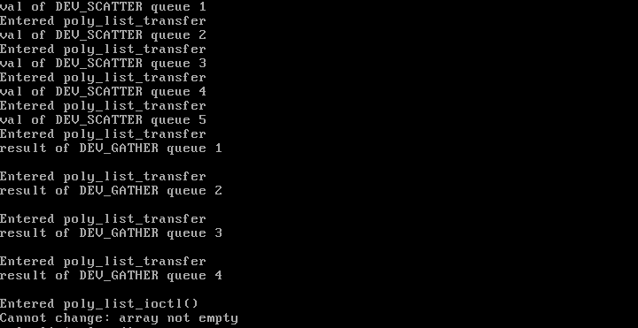
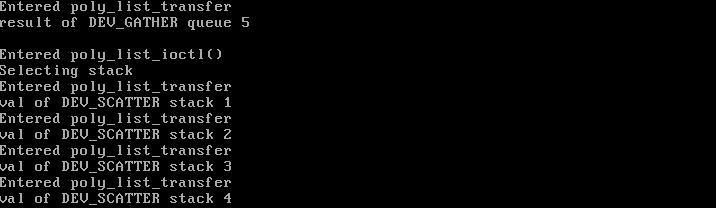
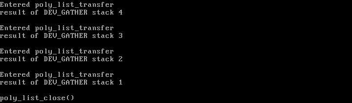

# 577 Device Driver Documentation

## 1. Goal
The Goal of this section is to implement a device driver.
Minix3 is a micro-kernel OS where minix drivers lies outside the kernel. As mentioned in lecture devices can be block devices or character devices, although both are very important this lab only focuses on character device drivers.

## 2. Implementation
### 2.1 Directory Structure
The sub-directory looks as follows:

        |-- /driver/ # driver related deliverables
            |-- include
                |--sys # Contains the header file "poly_list.h"
            |-- src
                |--drivers
                    |--poly_list #Contains the main files for the driver
            |-- test # contains the user test file
            |-- images_driver # image results
            |-- README.md # Driver Related Documentation

### 2.2. Detailed Implementation

**Files and functions:**

In the driver implmentation, we have created a driver poly_list in the folder  `/usr/src/drivers`. This has three files - poly_list.c - this contains the main functionality of the driver, Makefile- details regarding the compilation, poly_list.conf- the permissions allowed to the driver. The header file for the driver is 'poly_list.h' and it contains the defined variables. I is kept in the folder `/usr/include/sys`.

In the poly_list.c file there are functions which help with many tasks such as initialization (messages on starting, refreshing and restoring versions),reading or writing information (poly_list_transfer()), opening and closing the driver (poly_list_open(), poly_list_close()), etc.

A device file "poly_list" has been created by using major number 20 and minor number 0 by using the command `mknod /dev/poly_list c 20 0 `.

**Queue and stack implementation:**

To implement the stack and queue, we have defined a structure for each of them. When the user wants to enqueue or push items, a write command is called, and when the user wants to dequeue pop, read command is used. The default implementation used is queue and it can be changed by sending an ioctl request to the driver. A global variable 'msgCase' is used to check if the implemetation in use or the implentation to change is a queue or a stack. This variable is by default set to queue. Whenever a read or a write command is issued, the poly_list_transfer() is invoked and depending on the opcode (read - DEV_GATHER_S/ write - DEV_SCATTER_S), required operations are performed. The poly_close operation closes the program and resets the datastructures and required variables.

Queue:

The queue structure named qstruct has 5 components- two (int) variables start and end for storing the indices of starting and ending locations, two (int) variable for storing the size and capacity of the queue and one array for storing the data. This structure is instantiated globally with initial values of zero for start, end and size variables, and 50 for capacity. When the user requests to enqueue a value in the queue, the poly_list_transfer() function is invoked. Here, 'msgCase' is used to check if the required implementation is a queue or a stack. If its a queue, memory is assigned to the array of the queue structure. Memory is only assigned when the size is zero making sure that it does not wipe out the existing data. Then, the following actions are performed:

(a) If a read command is issued, the start pointer is incremented as elements are removed from the beginning (FIFO) and the size is decremented. If the size is zero, the program returns by saying that read cannot be performed. 

(b) If a write command is issued, the end pointer is incremented as elements are added in the end, and the size is incremented. If the end pointer reaches its capacity, the method returns with a message saying that the array has reached its limit.

In the poly_close() operation, the start pointer and the end pointer are set back to the initial values ,i.e. 0 and the msgCase variable is set to QUEUE.

Stack:

The stack structure named sstruct has 3 components- two (int) variables for maintaining the top pointer(index of the last element added to the stack) and capacity of the stack, and one array for storing the data. This structure is instantiated globally with initial values of -1 for top and 50 for capacity. The data structure used is stack when the user requests an ioctl operation. When the user requests to push a value in the stack, the poly_list_transfer() function is invoked. Here, 'msgCase' is used to check if the required implementation is a queue or a stack. If its a stack, memory is assigned to the array of the stack structure. Memory is only assigned when the top pointer is -1 making sure that it does not wipe out the existing data. Then, the following actions are performed:

(a) If a read command is issued, the top value is decremented as the value is taken from the end (LIFO). If top is -1, the program returns by saying that read cannot be performed. 

(b) If a write command is issued, the top pointer is incremented as the elements are added in the end. If the top index reaches its capacity, the method returns with a message saying that the array has reached its limit.

In the poly_close() operation, the top pointer is set back to -1.
## Steps to run :##

## Results:##

The following tests were performed to check the evaluation:

0. The program will assume the RAM disk driver operates as queue
1. Open the driver
1. Enqueue 5 items to the queue
1. Dequeue the 4 items from the queue
1. Try to convert to stack and (of course as specified earlier it should fail)
1. Dequeue the last item
1. Convert to Stack
1. Push 4 items to the stack
1. Pop the items from the stack
1. Close the driver

The results obtained are as follows:

