# FUSE Documentation

## 1. Goal
The Goal of this section is to create file systems in user space (FUSE). FUSE is a concept applied in operating system where the filesystem is part of the kernel, this is why the FUSE part is done in **Linux**.
A filesystem is a method for storing and organizing computer files and directories and the data they contain, making it easy to find and access them. In most operating systems, filesystem is considered to be a part of the kernel, where adding or modifying the file system was an arduous process. In recent years an important concept have appeared File System in User Space or FUSE. 

## 2. Directory Structure
The sub-directory looks as follows:

        |-- /fuse/ # fuse related 
            |-- replica_fs.py # Fuse Implementation in Python  
            |-- replica_fs_bonus.py # Fuse Implementation in Python for Bonus section 
            |-- start.sh # Start script 
            |-- test # All shell scripts by test case
            |-- README.md # Fuse Related Documentation

### 3. Detailed Implementation

### 3.1. Design Choices
* The implementation of the file system has been done in Python. This was preferred to the C implementation because we encountered Segmentation Faults, and found that Python was easier to debug and also eliminated the need for a Makefile.
* Further, the implementation uses a single mount point. This mount point then houses the master and slave directories. Write operations have been restricted to the master directory only.
* Every file/directory in the master will have a copy in the slave directory. This was preferred to maintaining a single copy and having multiple links in order to assist fault tolerance.
* For the bonus section, more than one slave directory is created (based on the input number of replicas). The requests are further tracked in a log file.

### 3.2. FUSE API
In order to define a new file system, we implemented the following set of functions.

    getattr(self, path, fh=None)
    readdir(self, path, fh)
    mkdir(self, path, mode)
    rmdir(self, path)
    chmod(self, path, mode)
    chown(self, path, uid, gid)
    unlink(self, path)
    rename(self, old, new)
    open(self, path, flags)
    create(self, path, mode, fi=None)
    read(self, path, length, offset, fh)
    write(self, path, buf, offset, fh)
    release(self, path, fh)

These Functions are described as follows:

1. getattr: (self, path, fh=None); 
This is similar to stat(). It returns attributes of the target file such as creation time, mod time, number of links, inode number, etc.

1. readdir: (self, path, fh); 
This reads the contents of a dir and returns them as a list. Typically used for shell commands such as `ls`.

1. mkdir: (self, path, mode); 
This creates a directory. The permissions are specified by the mode argument.

1. rmdir: (self, path); 
This deletes a directory.

1. chmod: (self, path, mode); 
This is used to change the permissions of a file/directory.

1. chown: (self, path, uid, gid); 
This is used to change the owner of a file/directory. The uid specifies user ID and gid, the group ID.

1. unlink: (self, path); 
This is used to unlink a filanme from its inode number. This is typically called when the user attempts to delete a file. If the unlinking brings the number of links to 0, the inode is removed.

1. rename: (self, old, new); 
This is used to rename a file/directory. Typically called when the shell command `mv` is used.

1. open: (self, path, flags); 
This is used to open a particular file with corresponding flags. This checks if the operation is permitted for the given flags.

1. create: (self, path, mode, fi=None); 
This function is called when a file has to be created. 

1. read: (self, path, length, offset, fh); 
This reads data from an open file. Uses the lseek() function to set seek using the offset. It then invokes the os.read() function to read the specified length of data.

1. write: (self, path, buf, offset, fh); 
This writes data to an open file. Only the files in the master directory are allowed to perform this operation.

1. release: (self, path, fh); 
This releases an open file. release() is called when there are no more references to an open file — all file descriptors are closed and all memory mappings are unmapped.

### 3.3. Steps to Run

1. Run the start script as `start.sh 0` to run the basic setup with one master and one slave. To run the Python file that implements the bonus part, run the script as `start.sh <no. of replicas>`.
1. This then runs the respective Python file with the master and slave directories.
1. A mount directory `mount_dir` is created and mounted on `/var/tmp/replica`.
1. To run pre-defined test cases, run the scripts in the `test` directory.
1. To run miscellaneous tests, go to the path `/var/tmp/replica` and run them.
1. The bonus section includes the logging of requests in the `replica_fs.log` file.

### 3.3. Results
#### 3.3.1. Successful Scenarios

1. Create a Directory in the Master Mount Directory and check whether its created in the Slave Mount Directory
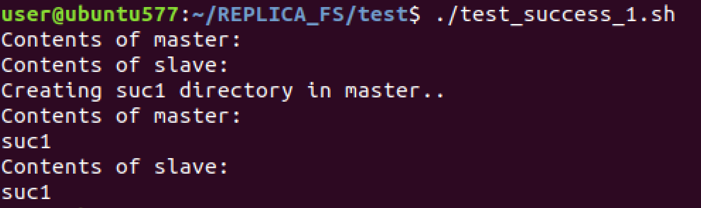
1. Create a File in the Master Mount Directory and check whether its created in the Slave Mount Directory
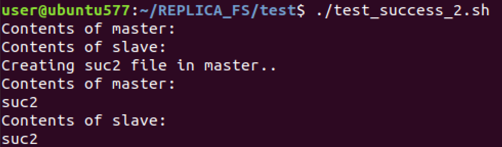
1. Update a File in the Master Mount Directory and check whether its updated in the Slave Mount Directory 
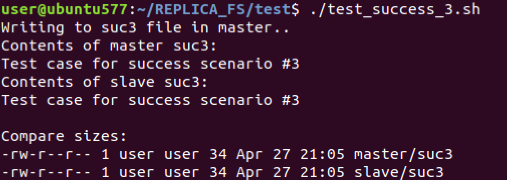
1. rename a Directory in the Master Mount Directory and check whether its renamed in the Slave Mount Directory
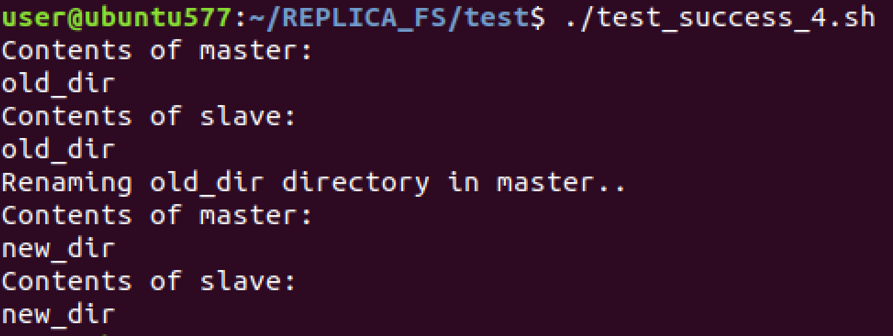
1. rename a File in the Master Mount Directory and check whether its renamed in the Slave Mount Directory
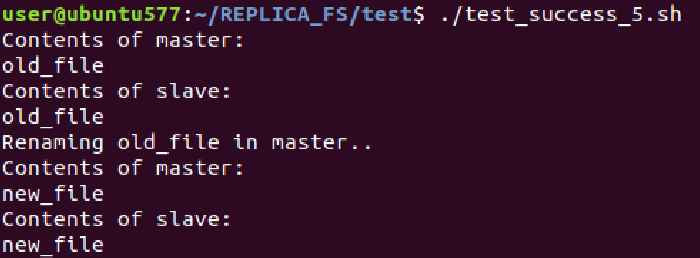
1. Delete a Directory in the Master Mount Directory and check whether its deleted in the Slave Mount Directory
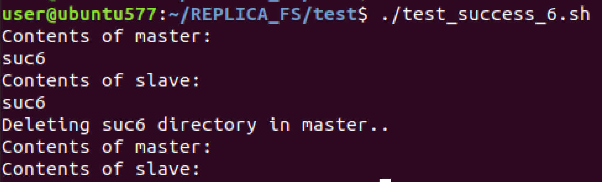
1. Delete a File in the Master Mount Directory and check whether its deleted in the Slave Mount Directory
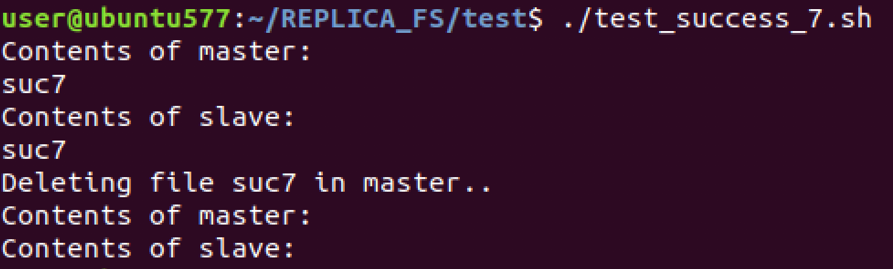
1. Change Permission of Directory in the Master Mount Directory and check whether its changed in the Slave Mount Directory
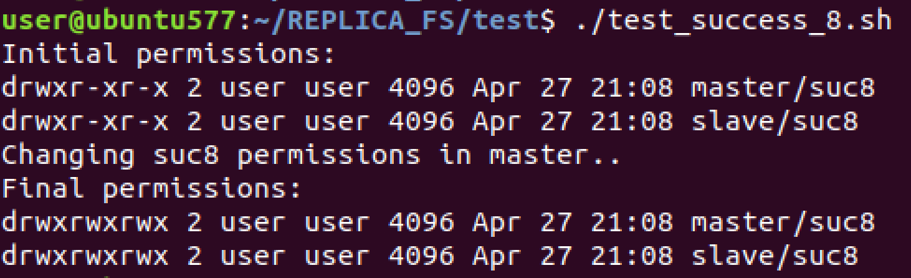
1. Change Permission of File in the Master Mount Directory and check whether its changed in the Slave Mount Directory
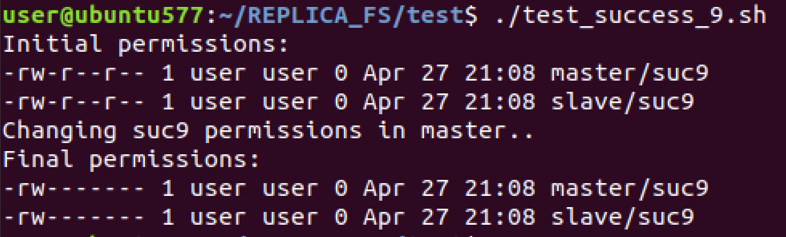

#### 3.3.2 Failing Scenarios

1. Create a Directory in the Slave Mount Directory
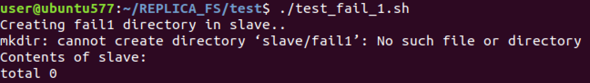
1. Delete a Directory in the Slave Mount Directory
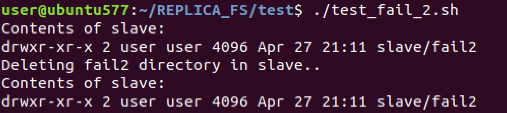
1. Rename a Directory in the Slave Mount Directory
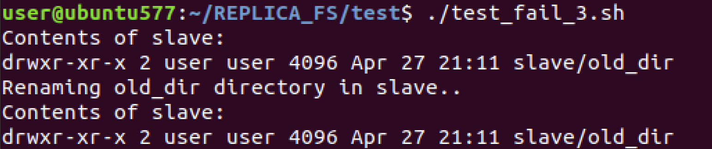
1. Update Directory permissions in the Slave Mount Directory
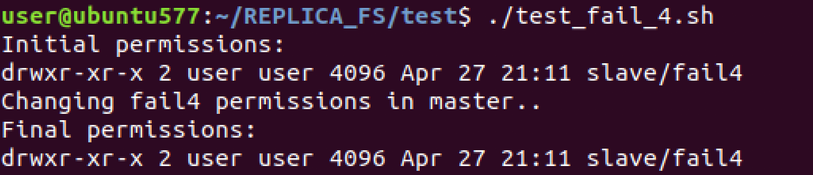
1. Create a File in the Slave Mount Directory
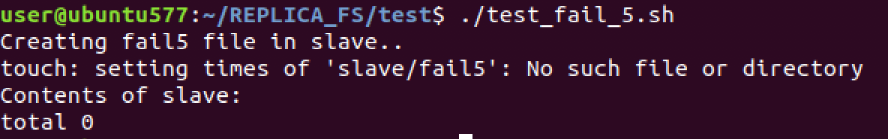
1. Delete a File in the Slave Mount Directory
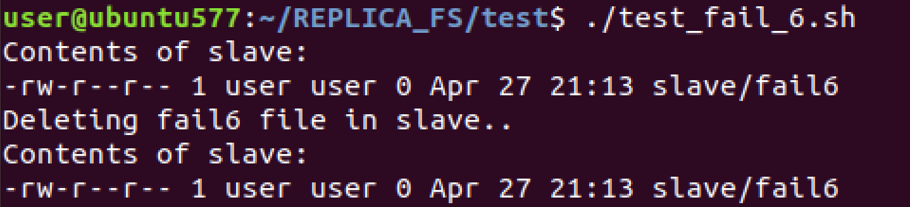
1. Rename a File in the Slave Mount Directory
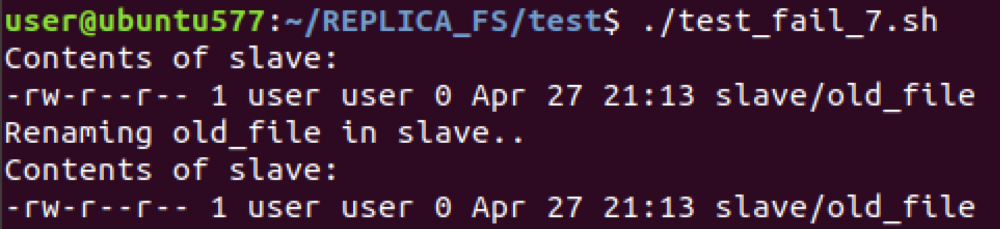
1. Update File permissions in the Slave Mount Directory
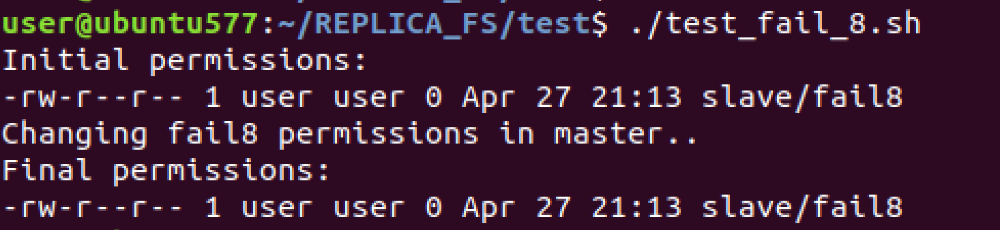
1. Update a File in the Slave Mount Directory
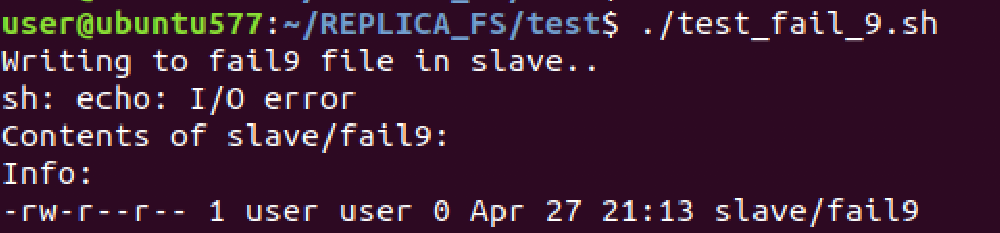

#### 3.3.3 Bonus Section - Log file

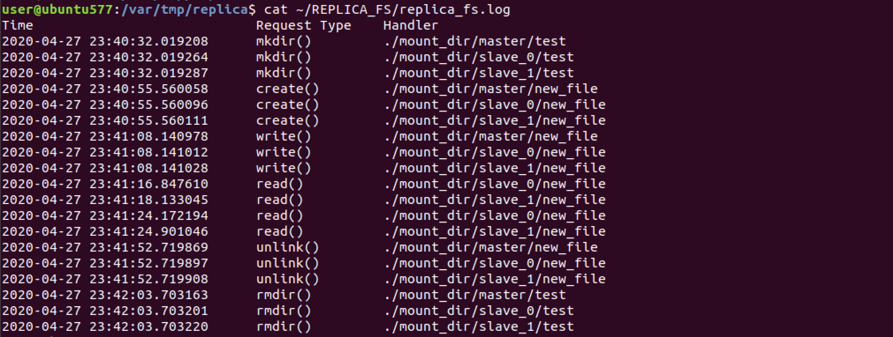
